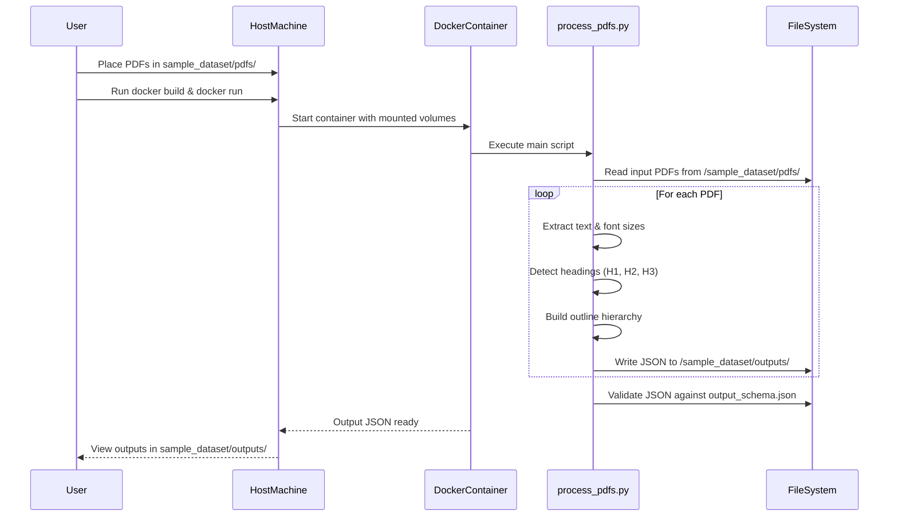

# Adobe-India-Hackathon25-1a
[](https://www.docker.com/) [](LICENSE) [](sample_dataset/schema/output_schema.json)
### Submission for Adobe India Hackathon 2025 challenge 1a

Overview: This project processes a set of PDF documents and extracts a hierarchical outline of headings (levels H1–H3) along with their page numbers. Each PDF in `sample_dataset/pdfs/` yields a corresponding JSON file in `sample_dataset/outputs/` that conforms to a strict JSON schema.

## Table of Contents

1. [Architecture](#architecture)  
2. [Prerequisites](#prerequisites)  
3. [Project Structure](#project-structure)  
4. [Build Instructions](#build-instructions)  
5. [Usage](#usage)  
6. [Validation](#validation)  
7. [Extensibility](#extensibility)  


## Architecture

```

┌──────────────────────────────┐
│         Docker Container     │
│                              │
│  ┌─────────────────────────┐ │
│  │ Python 3.10-Slim Image  │ │
│  │   ┌───────────────────┐ │ │
│  │   │ process\_pdfs.py   │ │ │
│  │   │ ┌───────────────┐ │ │ │
│  │   │ │ sample\_dataset│ │ │ │
│  │   │ │ ┌───┐ ┌───────┐│ │ │ │
│  │   │ │ │pdfs│ │outputs││ │ │ │
│  │   │ │ └───┘ └───────┘│ │ │ │
│  │   │ └───────────────┘ │ │ │
│  │   └───────────────────┘ │ │
│  └─────────────────────────┘ │
└──────────────────────────────┘

```



1. **Dockerfile**  
   - Defines a Python 3.10-slim image  
   - Installs PyMuPDF dependency  
   - Copies `process_pdfs.py` and the `sample_dataset/` directory  
2. **process_pdfs.py**  
   - Opens each PDF in `sample_dataset/pdfs/`  
   - Detects headings by font-size heuristics (H1 > 20pt, H2 > 16pt, H3 > 13pt)  
   - Writes JSON outlines to `sample_dataset/outputs/`  
3. **sample_dataset/schema/output_schema.json**  
   - JSON Schema for validating output structure  


## Prerequisites

- Docker Engine (v19.03 or higher)  
- Host filesystem with read/write permissions  


## Project Structure

```bash

Challenge\_1a/
├── sample\_dataset/
│   ├── pdfs/                  # Input PDF files
│   │   ├── AD1.pdf
│   │   ├── AD2.pdf
│   │   ├── AD3.pdf
│   │   └── AD4.pdf
│   ├── outputs/               # Generated JSON outlines
│   │   ├── AD1.json
│   │   ├── AD2.json
│   │   ├── AD3.json
│   │   └── AD4.json
│   └── schema/
│       └── output\_schema.json # JSON schema definition
├── Dockerfile                 # Container configuration
├── process\_pdfs.py            # PDF parsing and JSON generation
├── requirements.txt           # Python dependencies
└── README.md                  # This documentation

```
## Build Instructions

```bash
# Build the Docker image
docker build --platform linux/amd64 -t pdf-outline-extractor .

# Verify the image
docker images | grep pdf-outline-extractor
```

## Usage

1. **Prepare Input**
   Place your PDF files in `sample_dataset/pdfs/`:

   ```bash
   cp AD1.pdf AD2.pdf AD3.pdf AD4.pdf sample_dataset/pdfs/
   ```

2. **Run the extractor**

   ```bash
   docker run --rm \
     -v "$(pwd)/sample_dataset/pdfs":/app/sample_dataset/pdfs:ro \
     -v "$(pwd)/sample_dataset/outputs":/app/sample_dataset/outputs \
     --network none \
     pdf-outline-extractor
   ```

3. **Inspect Outputs**

   ```bash
   ls sample_dataset/outputs/
   cat sample_dataset/outputs/AD1.json
   ```

## Validation

```bash
# Quick check using jq
jq --exit-status '.title and .outline' sample_dataset/outputs/*.json \
  && echo "All JSON files have required fields"

# Validate with AJV
ajv validate -s sample_dataset/schema/output_schema.json \
             -d sample_dataset/outputs/*.json
```

## Extensibility

* Integrate OCR (Tesseract + pdf2image) for scanned documents
* Use regex or machine-learning techniques to detect numbered headings
* Parameterize font-size thresholds for multi-language support


## License
This project is licensed under the MIT License. See [LICENSE](LICENSE) for details.
